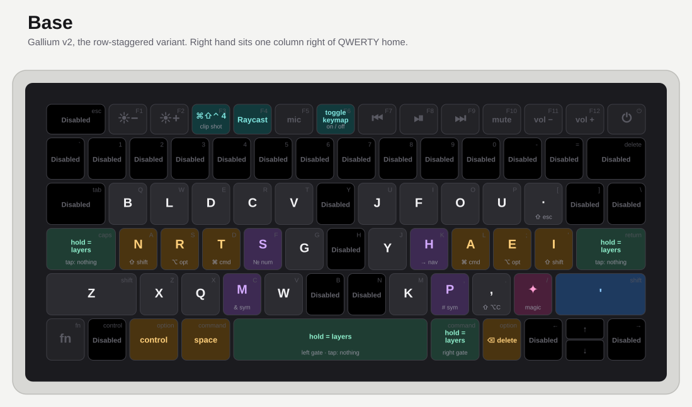
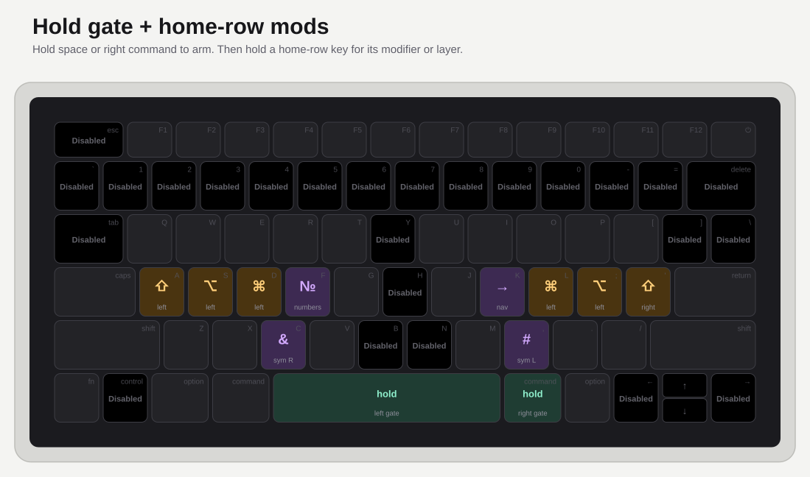
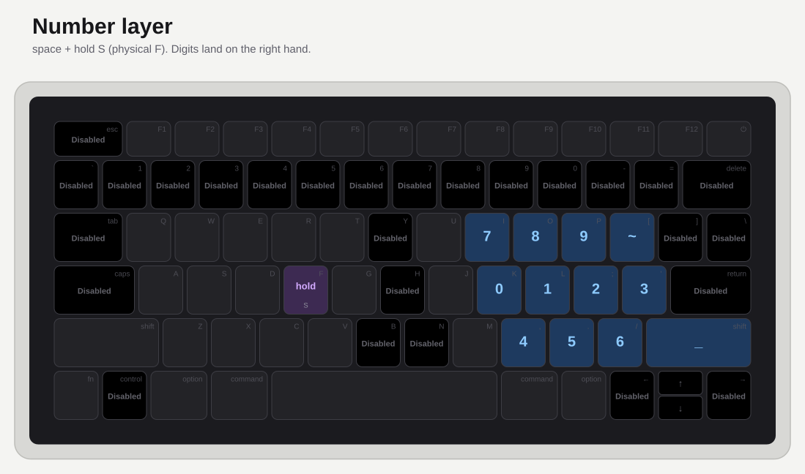
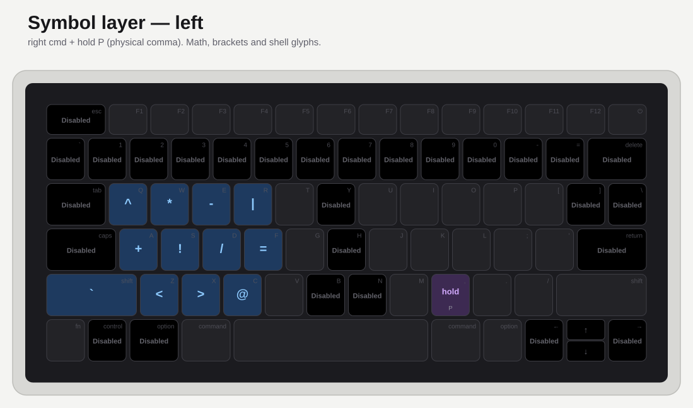
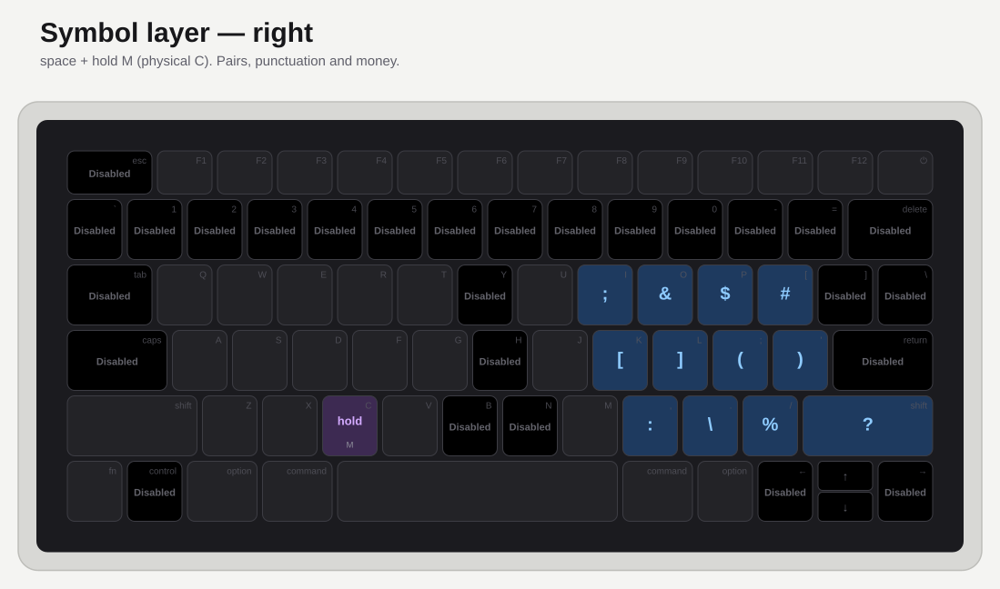
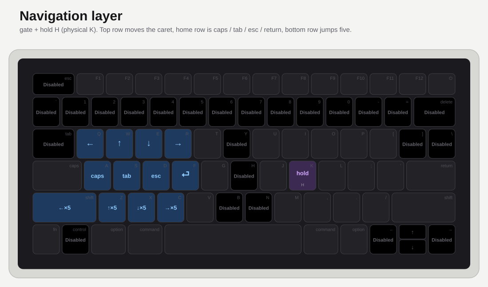

# godlike-keymap

A Karabiner-Elements config that turns a stock MacBook Air keyboard into an
ergonomic layered keyboard — alt alpha layout, home-row mods, four hold layers,
and a bad-habit trainer that punishes you for reaching.

No firmware. No external keyboard. One `karabiner.json`.

Inspired by [@getreuer's QMK keymap](https://github.com/getreuer/qmk-keymap),
which is the reference for what a well-documented personal keymap looks like.

---

## The idea

A laptop keyboard has no thumb cluster and no layer keys, so the usual QMK
tricks do not port over directly. This config works around that with three
moves:

1. **Everything worth reaching for moves onto the home row.** Numbers, symbols
   and arrows live on hold layers, not on the number row.
2. **Caps Lock and Return become a gate.** Hold either one and the home row
   turns into modifiers and layer keys. Let go and it is plain letters again —
   so there are no accidental mod-taps while typing at speed.
3. **The keys you should stop using fight back.** The number row, `esc`, `tab`,
   `delete`, the arrow cluster and the three worst reaches on the alpha block
   all type `HERROPERS` instead of doing their job.

Every diagram below shows a **US MacBook Air keyboard**. The small grey legend
in the corner of each cap is what is physically printed on it; the big legend is
what the key actually does.

---

## Base layer

<picture>
  <source media="(prefers-color-scheme: dark)" srcset="img/base-dark.svg">
  
</picture>

The alphas are a Hands-Down-family arrangement — the `H A E I` right home row is
the family's signature. The right hand sits **one column to the right** of where
QWERTY puts it, which is what frees up the `Y` / `H` / `B` column for the
trainer:

```
   B  L  D  C  V        J  F  O  U  -
   N  R  T  S  G        Y  H  A  E  I
   X  Q  M  W           Z  K  P  ,  .
```

Punctuation that is normally shifted moves down to the shift keys themselves:

| Physical key | Types |
| --- | --- |
| Left Shift | `'` |
| Right Shift | `;` |
| Left Command | tap `return`, hold `shift` |
| Right Option | tap `tab`, hold `shift` |
| Right Command | `delete` |
| Left Option | `control` |
| Caps Lock / Return | hold to arm the layers, tap does nothing |
| Shift + `/` | `esc` |
| Shift + `.` | `⌥C` |

---

## Hold gate and home-row mods

<picture>
  <source media="(prefers-color-scheme: dark)" srcset="img/mods-dark.svg">
  
</picture>

Hold **Caps Lock** or **Return** to arm the gate (`hold_mods_enabled`). While it
is held, four home-row keys become modifiers and four become layer keys:

| Home-row key | Physical | Hold |
| --- | --- | --- |
| `T` | `D` | Left Command |
| `A` | `L` | Right Command |
| `R` | `S` | Left Option |
| `E` | `;` | Right Option |
| `S` | `F` | Number layer |
| `H` | `K` | Navigation layer |
| `M` | `C` | Symbol layer, right |
| `P` | `,` | Symbol layer, left |

The gate is the whole trick. Home-row mods normally misfire during fast typing;
here they simply do not exist until you ask for them, and only one layer can be
active at a time — each layer key is conditioned on the other three being off.

Layer keys use a 100 ms hold threshold with a 100 ms delayed action, so a tap
still emits the letter.

---

## Number layer

<picture>
  <source media="(prefers-color-scheme: dark)" srcset="img/number-dark.svg">
  
</picture>

Gate + hold `S`. Digits sit under the right hand in a phone-pad-ish block:

```
   7  8  9        F O U
   0  1  2  3     H A E I
   4  5  6        K P ,
```

---

## Symbol layer — left

<picture>
  <source media="(prefers-color-scheme: dark)" srcset="img/sym-left-dark.svg">
  
</picture>

Gate + hold `P`. Held by the right hand, typed with the left:

```
   ^  <  >  |     B L D C
   +  !  /  =     N R T S
   `  ~  *  @     X Q M W
```

---

## Symbol layer — right

<picture>
  <source media="(prefers-color-scheme: dark)" srcset="img/sym-right-dark.svg">
  
</picture>

Gate + hold `M`. Held by the left hand, typed with the right:

```
   ;  &  $  #     F O U -
   [  ]  (  )     H A E I
   :  \  %  ?     K P , .
```

---

## Navigation layer

<picture>
  <source media="(prefers-color-scheme: dark)" srcset="img/nav-dark.svg">
  
</picture>

Gate + hold `H`. Home row moves the caret one step, the row below moves it five
at a time (five key events at 30 ms each):

```
   ←  ↑  ↓  →       N R T S
   ←5 ↑5 ↓5 →5      X Q M W
```

---

## The bad-habit trainer

Twenty-five keys are booby-trapped. Press one and it types `HERROPERS` — loudly,
in the middle of whatever you were writing:

`` ` `` `1` `2` `3` `4` `5` `6` `7` `8` `9` `0` `-` `=` `delete` `tab` `]` `\`
`esc` `control` `←` `→` `↑` `↓` and the `Y` / `H` / `B` positions.

Every one of them has a home-row replacement:

| Reach | Do this instead |
| --- | --- |
| Number row | gate + hold `S` |
| `-` `=` `[` `]` `\` and friends | the two symbol layers |
| Arrow keys | gate + hold `H` |
| `delete` | Right Command |
| `tab` | tap Right Option |
| `esc` | Shift + `/` |
| `return` | tap Left Command |

It is a blunt instrument and it works. Delete the rule named
`Bad-habit trainer` once the habit is gone — or keep it forever, nobody is
judging.

---

## Function row and system keys

| Key | Action |
| --- | --- |
| `F3` | `⌘⇧⌃4` — screenshot a region to the clipboard |
| `F4` | Raycast (`⌥⌃⌘⇧` + `a`) |
| `F5` | Launch Screenprompt |
| `F6` | Toggle the whole keymap on and off |
| `⌥` + `A` | Raycast |
| `⌥` + `S` | Mouseless |
| `⌥` + `E` | Homerow |
| `⌥` + `T` | `esc` |
| `⌥` + `J/K/L/;` | AeroSpace window focus (`⌥` + `h/a/e/i`) |
| `⌘⌃⌥⇧` + `D` | Mouseless free-click (`⌘⌃⌥⇧` + `tab`) |

`F6` runs [`toggle_profile.sh`](karabiner/toggle_profile.sh), which flips
Karabiner between the `Default profile` and a `Disabled` profile that contains
nothing but the toggle itself. Handy when someone else needs to use your laptop,
or when you need to type a password into a field that fights you.

---

## Install

Requires [Karabiner-Elements](https://karabiner-elements.pqrs.org/).

```sh
git clone git@github.com:noodleweapon/godlike-keymap.git
cd godlike-keymap

mkdir -p ~/.config/karabiner

# back up whatever you have now
cp ~/.config/karabiner/karabiner.json ~/.config/karabiner/karabiner.json.bak

cp karabiner/karabiner.json      ~/.config/karabiner/karabiner.json
cp karabiner/toggle_profile.sh   ~/.config/karabiner/toggle_profile.sh
chmod +x ~/.config/karabiner/toggle_profile.sh
```

Karabiner picks the file up as soon as it is written. Two paths in the config
point at this machine — the `F5` Screenprompt launcher and the `F6` toggle
script — so edit or drop those rules if you do not want them.

> **Warning:** this replaces your entire Karabiner config, and the alpha layout
> means you cannot touch-type on the machine until you learn it. Keep the backup
> and remember that `F6` turns everything off.

Rule order in `karabiner.json` matters. Karabiner chains manipulators, so each
rule sees the output of the ones above it — the trainer runs first so it wins on
`Y`/`H`/`B`, and `Left Option => Left Control` runs last so the `⌥`+letter
shortcuts above it still match.

---

## Regenerating the diagrams

The layout data lives in [`tools/keymap.py`](tools/keymap.py) and the SVGs are
generated from it:

```sh
python3 tools/render_svg.py     # writes img/*.svg
```

No dependencies beyond the standard library.

---

## Credits

- [Karabiner-Elements](https://karabiner-elements.pqrs.org/) by Takayama Fumihiko
- [@getreuer's QMK keymap](https://github.com/getreuer/qmk-keymap) for the
  documentation format
- [Hands Down](https://sites.google.com/alanreiser.com/handsdown) by R. Alan
  Reiser, whose layout family the alphas descend from

## License

MIT
