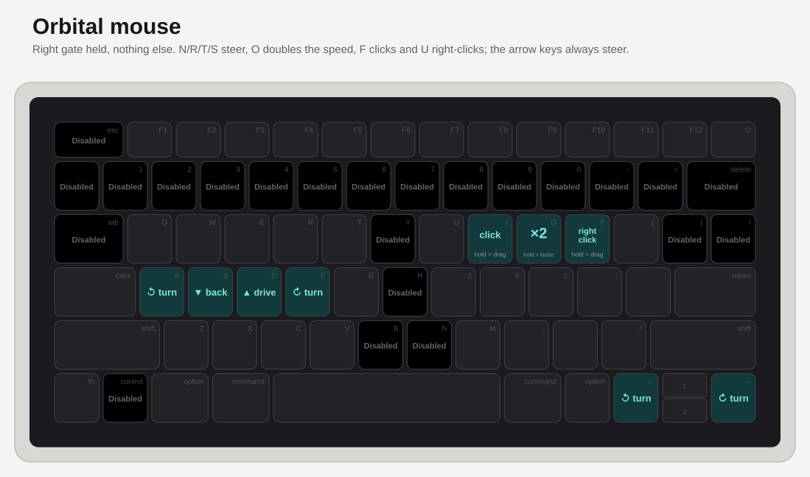

# splitmac

Split-keyboard ergonomics on a stock MacBook, in one Karabiner-Elements config.
The right hand moves a column over, the home row becomes modifiers and four hold
layers, and 26 keys you should stop reaching for are switched off.

No firmware. No external keyboard. One `karabiner.json`.

<table>
  <tr>
    <td>
      <a href="https://www.pcbway.com/">
        
      </a>
    </td>
    <td>
      This project is sponsored by <a href="https://www.pcbway.com/">PCBWay</a>,
      a one-stop shop for PCB prototyping, assembly, CNC machining and 3D
      printing. If you want to turn a keymap like this one into a real split
      board, they are a good place to have it made — see
      <a href="#sponsor">Sponsor</a> below for what they offer.
    </td>
  </tr>
</table>

The small grey legend in the corner of each cap is what is physically printed on
it. The big legend is what the key actually does.

---

### Base

<picture>
  <source media="(prefers-color-scheme: dark)" srcset="img/base-dark.svg">
  
</picture>

### Hold gate and home-row mods

<picture>
  <source media="(prefers-color-scheme: dark)" srcset="img/mods-dark.svg">
  
</picture>

### Number layer

<picture>
  <source media="(prefers-color-scheme: dark)" srcset="img/number-dark.svg">
  
</picture>

### Symbol layer — left

<picture>
  <source media="(prefers-color-scheme: dark)" srcset="img/sym-left-dark.svg">
  
</picture>

### Symbol layer — right

<picture>
  <source media="(prefers-color-scheme: dark)" srcset="img/sym-right-dark.svg">
  
</picture>

### Orbital mouse

<picture>
  <source media="(prefers-color-scheme: dark)" srcset="img/mouse-dark.svg">
  
</picture>

### Navigation layer

<picture>
  <source media="(prefers-color-scheme: dark)" srcset="img/nav-dark.svg">
  
</picture>

There is also an [interactive version](keymap.html) — open it and press keys on
your own keyboard to light up the matching cap, or hold Caps Lock (standing in
for the gate, which a web page cannot see) and a layer
key to preview a layer live.

Inspired by [@getreuer's QMK keymap](https://github.com/getreuer/qmk-keymap),
which is the reference for what a well-documented personal keymap looks like.

---

## The idea

A laptop keyboard has no thumb cluster and no layer keys, so the usual QMK
tricks do not port over directly. This config works around that with three
moves:

1. **Everything worth reaching for moves onto the home row.** Numbers, symbols
   and arrows live on hold layers, not on the number row.
2. **The trackpad's top edge is the gate.** Press either gate — the two
   rectangles along the top of the pad — and the home row turns into modifiers
   and layer keys. Let go and it is
   plain letters again — so there are no accidental mod-taps while typing at
   speed. No key on the keyboard arms it.
3. **The keys you should stop using are disabled.** The number row, `esc`,
   `tab`, `delete`, the arrow cluster and the three worst reaches on the alpha
   block do not do their job any more.

## Base layer

The alphas are [Gallium v2](https://github.com/GalileoBlues/Gallium), the
row-staggered variant of Gallium — which is the right choice here, because a
laptop keyboard is a row-staggered keyboard. Gallium v2 exists precisely for
boards like this one, rather than the column-staggered splits most alt layouts
are tuned for.

Fitting a 3×10 layout onto a MacBook means the top two rows of the right hand
sit **one column to the right** of where QWERTY puts them, which is what leaves
`Y`, `H` and `B` with nothing to do:

```
      B  L  D  C  V        J  F  O  U  ✦
      N  R  T  S  G        Y  H  A  E  I
   Z  X  Q  M  W              K  P  ,  .
```

That leading `Z` is **Left Shift** — the bottom row is one key short of a home
for it, so it moves onto the shift key and the old `Z` position (physical `N`)
is disabled too.

Punctuation that is normally shifted moves down to the shift keys themselves:

| Physical key | Types |
| --- | --- |
| Left Shift | `Z` |
| Right Shift | `'` |
| Caps Lock | tap `esc`, hold `shift` (left) |
| Return | tap `return`, hold `shift` |
| Right Command | `delete` |
| Left Option | `control` |
| Left Command / Right Option | nothing at all |
| Shift + `/` | `esc` |
| Shift + `.` | `⌥C` |

## The magic key

The `[` key has no letter of its own. It is a **magic key**: it emits whatever
should come after the letter you just typed. Thirteen of the layout's most
awkward bigrams are folded into one key that is always in the same place.

| You typed | `[` gives you | Bigram |
| --- | --- | --- |
| `p` | `y` | `py` — copy, type, happy |
| `s` | `c` | `sc` — scale, discuss |
| `u` | `e` | `ue` — value, queue |
| `r` | `l` | `rl` — world, early |
| `o` | `a` | `oa` — road, broad |
| `g` | `s` | `gs` — things, logs |
| `w` | `s` | `ws` — news, shows |
| `h` | `y` | `hy` — why, hyper |
| `t` | `m` | `tm` — batman, postman |
| `l` | `m` | `lm` — film, calm |
| `c` | `s` | `cs` — physics, basics |
| `m` | `c` | `mc` |
| `y` | `p` | `yp` — type, crypt |

After anything else — a digit, a symbol, a space, a fresh document — `[` does
nothing at all. Holding shift while you press it capitalises the letter, the
same way shift works on every other key here.

Each press feeds its own output back in, so the key chains: `r` `[` `[` `[` `[`
types `rlmcs`. Two of the pairs point at each other — `p`/`y` and `s`/`c` — so
repeated presses there simply alternate.

It reads the letter that *came out*, not the key you hit: the memory lives in a
Karabiner variable named `magic_prev`, and every manipulator in the config that
types a letter sets it while everything else clears it. That is why the space
bar and physical `G` — which otherwise pass straight through — now have
manipulators of their own, and why the magic key still works after a tapped
home-row mod or layer key.

The hyphen and underscore that used to sit on this key are gone with it. `-`
moved to the left symbol layer, `~` to the number layer on the magic key, and
`_` onto the spacebar behind the gate.

## Hold gate and home-row mods

Press either **gate** to arm it (`trackpad_gate`). While one is held,
four home-row keys become modifiers and four become layer keys:

| Home-row key | Physical | Hold |
| --- | --- | --- |
| `T` | `D` | Left Command |
| `A` | `L` | Left Command |
| `R` | `S` | Left Option |
| `E` | `;` | Left Option |
| `S` | `F` | Number layer |
| `H` | `K` | Navigation layer |
| `N` | `A` | Symbol layer, right |
| `I` | `'` | Symbol layer, left |

Every one of them sends the **left-hand** modifier — Left Command, Left Option,
Left Shift — whichever side of the board you hold it on. Nothing on this board
emits a right-hand modifier any more, so apps that tell the two sides apart
only ever see the left one.

The gate is the whole trick. Home-row mods normally misfire during fast typing;
here they simply do not exist until you ask for them, and only one layer can be
active at a time — each layer key is conditioned on the other three being off.

**Every hold latches on key-down, so order never matters.** All eight of them —
four layers, two Commands, two Options — are written the same way: `to` sets the
modifier or the layer variable the instant the key goes down, `to_if_alone`
emits the letter if you tap it and press nothing else, `to_after_key_up` clears
it on release. Hold the layer first or the modifier first; the result is
identical.

This is worth stating because the obvious way to write a layer key — a
`to_if_held_down` timer, optionally with a `to_delayed_action` — does not
compose. Both are cancelable by later key events, so whichever hold you started
first wins and the second one silently does nothing. Nothing here uses a timer.

One thing the gate cannot make order-free: it has to be armed *first*.
Conditions are evaluated when a key goes down, so a layer or modifier key
pressed before a gate sees `trackpad_gate` as 0 and just types its letter.

### The left and right gates

Two rectangles along the **top edge** of the trackpad, 12% deep, are the gate:
the **left gate** from 0 to 48% across, the **right gate** from 52 to 100%.
Press either and it arms for as long as the finger stays there, so the gate is
reachable by either thumb without leaving the home row and without having to
aim. Sliding a finger sideways along the left gate drives the [orbital
mouse](#the-orbital-mouse) and along the right gate turns it — that part needs
no press at all, only a finger resting in the rectangle and moving. Arming is
gated on pressure; steering is not. The 4% gap down the middle means a thumb landing dead centre catches
neither, rather than ambiguously both.

The right gate arms one thing more. While it is held and neither a layer nor a
modifier is — that is, while none of `H`, `A`, `E`, `I` are down — the left
hand's `N` `R` `T` `S` steer the [orbital mouse](#the-orbital-mouse): turn left,
back, forward, turn right — `T` drives, on the same finger as `⌘`. Hold `O`
alongside them for double speed. `F` and
`U` are the left and right buttons, held for as long as you hold the key, so a
tap clicks and a hold drags — and all three sit under the right hand, which is
free while the left one steers. Hold `H` and they go back to being caret arrows,
hold `A` or `E` and they are letters again, so the mouse layer never shadows
anything you were already reaching for. It is three zones in the config, not
two: `right_gate` and `right_gate_mouse` are the same rectangle, one raising
`trackpad_gate` and the other `trackpad_mouse`, with the second one's haptic
switched off so entering the right gate still ticks only once.

| Gate | Held alone | Held with `H` / `A` / `E` / `I` |
| --- | --- | --- |
| left gate | arms the gate | gate + that layer or modifier |
| right gate | arms the gate, and `NRTS` steer the mouse | gate + that layer or modifier |

`tools/trackpad_zones.swift` is what watches the pad. Karabiner's own
[Multitouch
Extension](https://karabiner-elements.pqrs.org/docs/json/extra/multitouch-extension/)
only publishes finger *counts* per half and quarter of the pad, which cannot
express "this patch", so this is a ~200-line replacement that takes rectangles
instead: `tools/trackpad_zones.json` gives each one an x, y, width and height in
percent — x and y being its left and top sides — plus the Karabiner variable it
raises.

    swiftc -O tools/trackpad_zones.swift -o tools/trackpad_zones
    tools/trackpad_zones --watch     # print live contacts and zone hits
    tools/trackpad_zones             # run it for real
    tools/trackpad_zones --selftest  # zone math, no hardware needed

Entering a zone ticks the Force Touch actuator, leaving it ticks again — the
zones are invisible targets, so without feedback you cannot tell 20% from 24%
until a keystroke comes out wrong. That runs through `MTActuator*` in the same
private framework: `MTActuatorCreateFromDeviceID` wants the ID from
`MTDeviceGetDeviceID`, *not* the IOKit registry entry ID the real extension uses
for its own bookkeeping, which just returns null. `haptic_enter_id` and
`haptic_exit_id` pick the click weight (0 silences one), and

    tools/trackpad_zones --haptic-test

fires all eight IDs the pad accepts, 0.8s apart, so you can choose by feel.
Ticks fire on the transition only, never per contact frame — the callback runs at
up to 120Hz and actuating on every frame is a continuous buzz. `hysteresis`
(default 1.5%) pushes every side of a zone out once a finger is inside it, so a
contact resting on the boundary does not rattle the variable and the actuator on
and off.

It needs **Input Monitoring** permission, same as the real extension. Without it
the process runs and no contact frame ever arrives, so `--watch` just sits there
silently — that empty screen is the symptom, not a hang. Variables reach Karabiner
through `karabiner_cli --set-variables-from-stdin`, so nothing has to be signed or
linked against Karabiner's own libraries. `release_delay_ms` (default 250) keeps a
zone up briefly after the finger leaves, so a sloppy lift does not drop a chord
half-way through.

Nine manipulators read `trackpad_gate`: the four layer keys, the two Commands,
the two Options, and the spacebar's `_`. Each carries one condition,
`variable_unless trackpad_gate 0`. Karabiner ANDs conditions and has no OR, so if
you ever want a key to arm the gate as well, do not add a second copy of those
nine — have the key `set_variable` `trackpad_gate` to 1 on key-down and 0 on
key-up. It is an ordinary variable; anything may raise it.

This is currently the only way to arm the gate, so `trackpad_zones` is not
optional: with nothing running to set it, `trackpad_gate` stays unset, Karabiner
reads that as 0, and the layers and home-row mods are simply unreachable. The
keyboard still types its base letters.

Each layer also borrows some home-row keys for its own glyphs, which shadows the
modifier on those keys. One pair always survives:

| Layer (held with) | Modifiers still reachable |
| --- | --- |
| Number — physical `F` | Left Command `D`, Left Option `S` |
| Symbol right — physical `A` | Left Command `D`, Left Option `S` |
| Symbol left — physical `'` | Left Command `L`, Left Option `;` |
| Navigation — physical `K` | Left Command `L`, Left Option `;` |

In every case the surviving pair is on the same hand that holds the layer, which
takes some getting used to. The other hand's Command and Option are typing layer
glyphs and cannot also be modifiers.

## The layers

**Number** — gate + hold `S`. Digits sit under the right hand, with `~` on the
magic key:

```
   7  8  9  ~     F O U ✦
   0  1  2  3     H A E I
      4  5  6        K P , . '
```

`_` is not on this layer. It is on the **spacebar**, and it only needs the gate —
no layer key — so it is one thumb press away from anywhere.

**Symbol, left** — gate + hold `I`. Held by the right hand, typed with the left:

```
   ^  *  -  |     B L D C
   +  !  /  =     N R T S
`  <  >  @        Z X Q M
```

**Symbol, right** — gate + hold `N`. Held by the left hand, typed with the right:

```
   ;  &  $  #     F O U ✦
   [  ]  (  )     H A E I
      :  \  %  ?     P , . '
```

**Navigation** — gate + hold `H`. Home row moves the caret one step, the row
below moves it five at a time (five key events at 30 ms each). `tab` and `~` sit
on the row above, on the physical `E` and `B` caps:

```
      ⇥        ~    B L D C ✦
   ←  ↑  ↓  →       N R T S
←5 ↑5 ↓5 →5         Z X Q M
```

## The orbital mouse

The arrow keys drive the pointer like a tank:

| Key | Does |
| --- | --- |
| `↑` / `↓` | drive forward and backward along the pointer's heading |
| `←` / `→` | rotate in place about the dot drawn just ahead of the pointer |
| right gate + `NRTS` | turn left, back, forward, turn right |
| right gate + `O` | hold for double speed |
| right gate + `F` | left button — tap to click, hold to drag |
| right gate + `U` | right button, likewise |

A tank, not a car: turning does not carry the pointer anywhere, it swings the
pointer around the dot. That dot is the centre of rotation, `orbit_radius`
pixels along the heading, and it is *derived* every tick rather than stored:

    dot = position + radius * heading

A turn rotates the position about the dot and the heading by the same angle,
which has two consequences. The dot does not move during a pure turn, so the
pointer sweeps a true circle around it and no integration error accumulates:
360 degrees of turning returns to the starting pixel. And at a radius of ten
pixels the pointer never strays further than the circle's diameter however long
you hold the key — it spins on the spot. Driving then carries pointer and dot
along together.

The dot is also the heading readout. The ordinary cursor is left alone; the dot
rides a few pixels off it in whatever direction the pointer faces, so the pair
tells you which way `↑` will go. It lives in a borderless overlay window at
`CGShieldingWindowLevel`, on every space, ignoring mouse events, glued to the
pointer every tick whether the arrow keys moved it or the trackpad did. Set
`pivot_dot` to false to hide it.

The heading resets to "up the screen" whenever the trackpad moves the cursor. A
real tank keeps its facing when you carry it, but ten pixels of offset is a
faint readout, so without the reset `↑` could drive off along whatever angle the
last spin happened to end on.

Karabiner cannot do any of this. `mouse_key` is a constant velocity along a
fixed axis with no heading to steer, so `tools/orbital_mouse.swift` does the
steering and Karabiner only reports the keys:

```json
"to": [{ "shell_command": "printf l1 > /dev/udp/127.0.0.1/45454", "repeat": false }],
"to_after_key_up": [{ "shell_command": "printf l0 > /dev/udp/127.0.0.1/45454" }]
```

`/bin/sh` on macOS is bash in sh mode, so it has `/dev/udp` — one datagram per
press, no helper process, and `repeat: false` stops key auto-repeat from
resending it. `b1`/`b0` is the boost key: while it is held, the turn angle and
the drive distance are both multiplied by `fast_multiplier` (2). Boost is a rate
rather than a direction of its own, which is why it is one key reported once
instead of a second set of fast bindings. UDP means no event tap and **no Accessibility grant**: the pointer
moves with `CGWarpMouseCursorPosition`, which needs no permission. A `mouseMoved`
event is posted alongside it so hover states update where Accessibility happens
to be granted, and is silently dropped where it is not. If the daemon is not
running the datagrams go nowhere and the arrows simply do nothing.

    swiftc -O tools/orbital_mouse.swift -o tools/orbital_mouse
    tools/orbital_mouse             # run it
    tools/orbital_mouse --watch     # print heading and pivot as you steer
    tools/orbital_mouse --selftest  # orbit maths, no hardware

The buttons are Karabiner's own `pointing_button`, not this daemon's doing: it
holds the last `to` event for as long as the key is down, which is exactly a
press-and-hold button. The daemon only has to notice them — a pointer moving
with a button down posts `leftMouseDragged` or `rightMouseDragged` rather than
`mouseMoved`, because that is the event apps track a drag by.

`tools/orbital_mouse.json` holds `orbit_radius` (120px),
`turn_degrees_per_second` (180), `forward_speed` (800px/s) and `tick_hz` (120).
The trackpad still owns the pointer: if it moved the cursor since the last tick,
the rig adopts that position and steers on from there.

## The disabled keys

Twenty-two keys are booby-trapped. They do not just do nothing — press one and
it types `HERROPERS`, loudly, in the middle of whatever you were writing:

`` ` `` `1` `2` `3` `4` `5` `6` `7` `8` `9` `0` `-` `=` `delete` `tab` `]` `\`
`esc` `control` and the `Y` / `H` / `B` / `N` positions.

The four arrow keys used to be on that list. They are the **orbital mouse** now,
described below. The caret still moves on the navigation layer, which is the
reach the trainer was defending.

Every one of them has a home-row replacement:

| Reach | Do this instead |
| --- | --- |
| Number row | gate + hold `S` |
| `-` `=` `[` `]` `\` and friends | the two symbol layers |
| Arrow keys, for the caret | gate + hold `H` |
| `delete` | Right Command |
| `tab` | gate + hold `H`, then physical `E` |
| `esc` | tap Caps Lock, or Shift + `/` |

It is a blunt instrument and it works. Delete the rule named
`Bad-habit trainer` once the habit is gone — or keep it forever, nobody is
judging.

## Function row and system keys

| Key | Action |
| --- | --- |
| `F3` | `⌘⇧⌃4` — screenshot a region to the clipboard |
| `F4` | Raycast (`⌥⌃⌘⇧` + `a`) |
| `F6` | Toggle the whole keymap on and off |
| `⌥` + `A` | Raycast |
| `⌥` + `S` | Mouseless |
| `⌥` + `E` | Homerow |
| `⌥` + `T` | `esc` |
| `⌥` + `J/K/L/;` | AeroSpace window focus (`⌥` + `h/a/e/i`) |
| `⌥` + `F` | AeroSpace shrink window (`⌥` + `s` — `resize smart -50`) |
| `⌘⌃⌥⇧` + `D` | Mouseless free-click (`⌘⌃⌥⇧` + `tab`) |

`F6` runs [`toggle_profile.sh`](karabiner/toggle_profile.sh), which flips
Karabiner between the `Default profile` and a `Disabled` profile that contains
nothing but the toggle itself. Handy when someone else needs to use your laptop,
or when you need to type a password into a field that fights you.

## Install

Requires [Karabiner-Elements](https://karabiner-elements.pqrs.org/).

```sh
git clone git@github.com:noodleweapon/splitmac.git
cd splitmac

mkdir -p ~/.config/karabiner

# back up whatever you have now
cp ~/.config/karabiner/karabiner.json ~/.config/karabiner/karabiner.json.bak

cp karabiner/karabiner.json      ~/.config/karabiner/karabiner.json
cp karabiner/toggle_profile.sh   ~/.config/karabiner/toggle_profile.sh
chmod +x ~/.config/karabiner/toggle_profile.sh
```

Karabiner picks the file up as soon as it is written. One path in the config
points at this machine — the `F6` toggle script — so edit or drop that rule if
you do not want it.

> **Warning:** this replaces your entire Karabiner config, and the alpha layout
> means you cannot touch-type on the machine until you learn it. Keep the backup
> and remember that `F6` turns everything off.

Rule order in `karabiner.json` matters. Karabiner chains manipulators, so each
rule sees the output of the ones above it — the disabled-key rule runs first so
it wins on `Y`/`H`/`B`/`N`, and `Left Option => Left Control` runs last so the
`⌥`+letter shortcuts above it still match.

## Regenerating the diagrams

The layout data lives in [`tools/keymap.py`](tools/keymap.py) and everything
else is generated from it:

```sh
python3 tools/render_svg.py     # writes img/*.svg
python3 tools/build_html.py     # writes keymap.html
```

No dependencies beyond the standard library.

## Sponsor

<a href="https://www.pcbway.com/">
  
</a>

[PCBWay](https://www.pcbway.com/) sponsors this project. They are a one-stop
shop for turning a hardware idea into a physical thing: PCB prototyping and
small-batch fabrication, PCB assembly, CNC machining, sheet metal, injection
moulding and 3D printing (resin, nylon, and metal), all ordered from one
account with an instant online quote.

Why they are a good fit for a keyboard project:

- **Cheap, fast prototypes.** A handful of 2-layer boards costs a few dollars
  and ships in days, so a keymap idea can become a real split board without a
  big commitment.
- **One order, every part.** Plates, cases and the PCB itself can all come from
  the same order — CNC-cut aluminium or 3D-printed cases alongside the boards.
- **Assembly included.** Hand-soldering a hundred hot-swap sockets is optional;
  PCBWay can populate the boards for you.
- **Real humans in support.** Every order is checked by an engineer before it
  goes to fabrication, and the DFM feedback comes back quickly.

If you use them, say hello from `splitmac`.

## Credits

- [PCBWay](https://www.pcbway.com/) for sponsoring the project
- [Karabiner-Elements](https://karabiner-elements.pqrs.org/) by Takayama Fumihiko
- [@getreuer's QMK keymap](https://github.com/getreuer/qmk-keymap) for the
  documentation format
- [Gallium](https://github.com/GalileoBlues/Gallium) by GalileoBlues — the
  alpha layout. This config uses v2, the row-staggered version

## License

MIT
